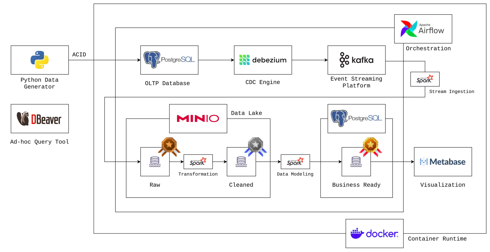
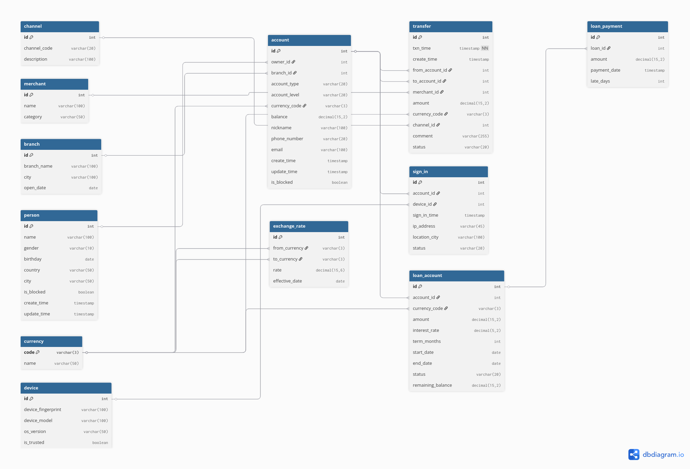
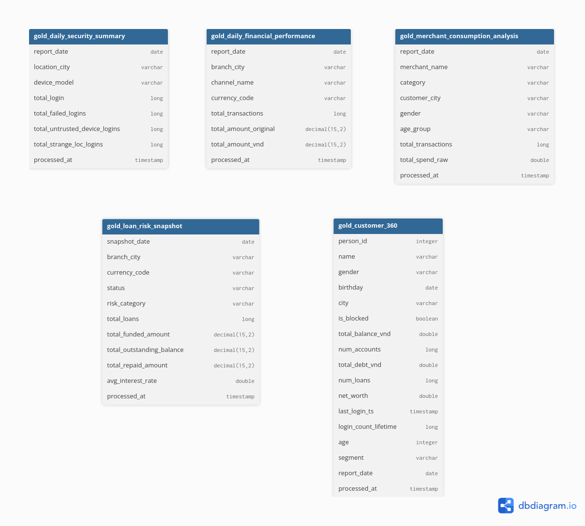
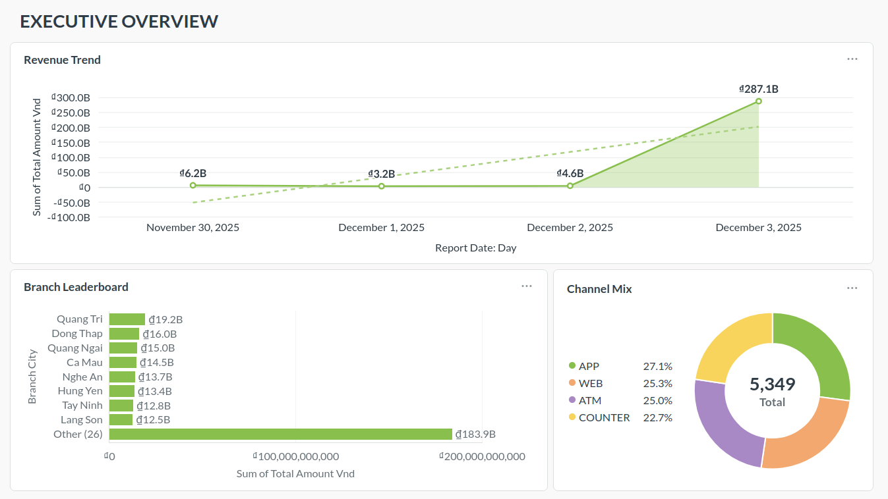
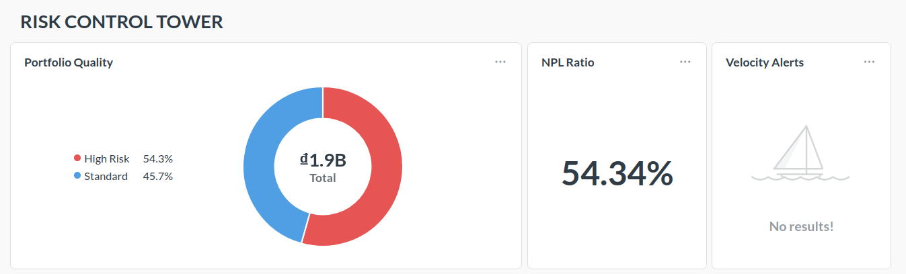
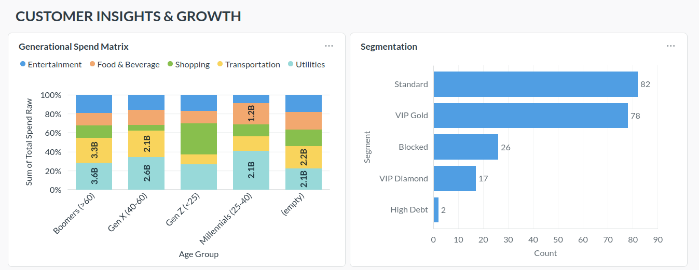
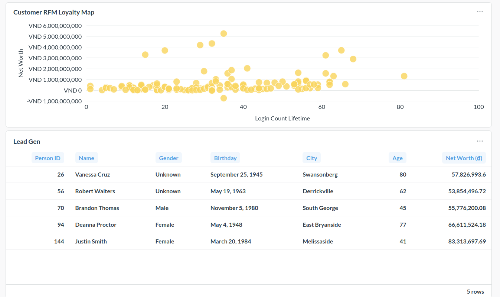

# SafeBank Data Platform

[](https://www.python.org/)
[](https://docs.docker.com/compose/)
[](https://airflow.apache.org/)
[](https://www.postgresql.org/)
[](https://www.confluent.io/)
[](https://zookeeper.apache.org/)
[](https://debezium.io/)
[](https://min.io/)
[](https://spark.apache.org/)
[](https://www.metabase.com/)

Architected a production-grade Banking Data Lakehouse capable of processing real-time ACID transactions. The platform leverages Debezium for low-latency CDC ingestion and Spark Structured Streaming to orchestrate a multi-hop Medallion architecture on Delta Lake. It solves complex financial engineering challenges, including SCD Type 2 history tracking for compliance, multi-currency normalization, and fraud detection, delivering actionable insights via automated Executive Dashboards.

---

## Table of Contents

1. [Overview](#1-overview)
2. [Problem Statement & Goals](#2-problem-statement-and-project-goals)
3. [Architecture & Tech Stack](#3-architecture-and-tech-stack)
4. [Data Modeling](#4-data-modeling)
5. [Key Features](#5-key-features)
6. [Dashboard](#6-dashboard)
7. [Project Structure](#7-project-structure)
8. [Setup & Installation](#8-setup--installation)
9. [How to Reproduce](#9-how-to-reproduce)
10. [Future Roadmap](#10-future-roadmap)

---

## 1\. Overview

SafeBank Data Platform is a comprehensive, end-to-end data engineering project designed to simulate the data infrastructure of a modern digital bank. Built entirely on a Docker ecosystem, the project replicates a complex Core Banking Schema consisting of 12 relational tables (Transactions, Loans, Accounts, Customers, etc.).

The system generates synthetic, realistic banking data (including noise and anomalies) using Python and inserts it into a PostgreSQL OLTP database. To bridge the gap between transactional operations and analytics, the platform utilizes Debezium and Kafka for Change Data Capture (CDC), ensuring low-latency data streaming.

Data processing is handled by Apache Spark, following the Medallion Architecture:

- Bronze Layer: Raw data ingestion into MinIO (Data Lake).
- Silver Layer: Data cleaning, deduplication, and SCD Type 2 implementation for historical tracking.
- Gold Layer: Aggregated Data Marts stored in PostgreSQL (Serving Layer).

Finally, the pipeline culminates in a Metabase visualization layer, providing real-time insights for executives, risk officers, and marketing teams. The entire workflow is fully automated and orchestrated by Apache Airflow.

---

## 2\. Problem Statement & Goals

### The Challenge

In the banking sector, data often resides in siloed legacy systems (OLTP), making it difficult to perform advanced analytics without impacting transactional performance. Traditional ETL pipelines are often batch-based, leading to stale data, while modern compliance requires strict tracking of historical changes (e.g., a customer's address history or loan status changes).

Furthermore, raw banking data is inherently "messy" - containing multi-currency transactions, inconsistent formatting, and potential fraud patterns that require sophisticated transformation logic to become valuable.

### Project Goals

To address these challenges, the SafeBank Data Platform aims to achieve:

- Scalability: Decouple Compute and Storage using a Data Lakehouse architecture (MinIO + Delta Lake), allowing the system to handle increasing transaction volumes without performance degradation.
- Automation: Eliminate manual intervention by orchestrating the entire lifecycle - from ingestion to reporting - using Airflow DAGs.
- Data Quality & Integrity: Ensure ACID compliance at the storage layer and implement robust data cleaning pipelines to handle "dirty" data (e.g., negative balances, invalid dates).
- Actionable Insights: Transform raw logs into meaningful business metrics for decision-making.

### Key Business Questions

The platform is designed to answer critical business questions across three main pillars:

**1. Financial & Operational Performance**

- Revenue Trend: How is the total transaction volume (normalized to VND) trending day-over-day?
- Branch Leaderboard: Which branches are performing best in terms of transaction volume?
- Channel Mix: What is the usage distribution between Mobile App, Web, and ATM?

**2. Risk & Security Control**

- Portfolio Quality: What is the breakdown of the loan portfolio (Standard vs. High Risk)?
- NPL Ratio: What is the current Non-Performing Loan ratio across the bank?
- Velocity Alerts: Are there accounts receiving an abnormal number of transactions in a short window (Smurfing detection)?

**3. Customer Growth & Marketing**

- Generational Spend Matrix: How do spending habits differ between Gen Z, Millennials, and Boomers?
- Segmentation: Who are the VIP Diamond clients versus Standard users?
- Customer RFM Loyalty Map: Mapping customers based on Recency, Frequency, and Monetary value.
- Lead Gen: Which standard customers qualify for an upsell to Gold/Platinum tiers?

---

## 3. Architecture & Tech Stack

### 3.1 Architecture

The project is architected as a modern Data Lakehouse, fully containerized within Docker. It follows a strictly decoupled Medallion Architecture, ensuring data quality progression from raw logs to business-ready aggregates.



Data Flow:

1.  Source (OLTP): A Python generator simulates banking activities (ACID transactions, account updates) into PostgreSQL.
2.  Ingestion (CDC): Debezium captures row-level changes from Postgres WAL logs and pushes them to Kafka.
3.  Bronze Layer (Raw): Spark Structured Streaming consumes Kafka topics and dumps raw history into MinIO (Delta Lake).
4.  Silver Layer (Cleansed): Spark processes raw data to deduplicate, clean (regex/casting), and handle SCD Type 2 history.
5.  Gold Layer (Aggregated): Business logic is applied to create specialized Data Marts (Star Schemas) stored in PostgreSQL for serving.
6.  Serving: Metabase connects to the Gold Layer to visualize KPIs and trends.
7.  Orchestration: Apache Airflow manages the dependencies and scheduling of all Spark jobs.

### 3.2 Tech Stack Decisions

| Category      | Technology     | Purpose             | Why this choice?                                                                                                         |
| :------------ | :------------- | :------------------ | :----------------------------------------------------------------------------------------------------------------------- |
| Source System | PostgreSQL     | Core Banking OLTP   | Standard relational DB supporting ACID compliance and Write-Ahead Logging (WAL) for CDC.                                 |
| Ingestion     | Debezium       | Change Data Capture | Captures real-time database changes (Inserts/Updates/Deletes) with zero data loss.                                       |
| Streaming     | Apache Kafka   | Message Buffer      | Decouples the high-throughput source from the downstream processing layer; ensures back-pressure handling.               |
| Processing    | Apache Spark   | Distributed Compute | Unified engine for both streaming (Bronze) and batch (Silver/Gold) processing; handles complex transformations at scale. |
| Storage       | MinIO          | Object Storage      | S3-compatible storage for the Data Lake; separates compute from storage (Lakehouse principle).                           |
| Format        | Delta Lake     | Storage Format      | Adds ACID transactions, versioning, and time-travel capabilities to the data lake.                                       |
| Serving       | PostgreSQL     | Data Mart Serving   | High-performance query engine for BI tools (Gold layer sink).                                                            |
| Orchestration | Apache Airflow | Workflow Management | Python-based DAGs for scheduling complex dependencies and monitoring pipeline health.                                    |
| BI            | Metabase       | Visualization       | Open-source, easy-to-use dashboarding tool for rapid business intelligence.                                              |

---

## 4. Data Modeling

### 4.1 Operational Schema (Source)

The source system mimics a Core Banking Schema with 12 normalized entities, designed to support transactional integrity and historical tracking.

The initial operational schema was inspired by [the LDBC FinBench benchmark](https://ldbcouncil.org/benchmarks/finbench/), a standard for financial data management. However, to support broader analytics scenarios (such as multi-currency reporting and device-based fraud detection), the schema was significantly extended and normalized into a 12-table architecture suitable for modern Data Warehousing.


_(See `scripts/sql/core_schema.sql` for DDL details)_

Key Design Decisions:

- Dimensions & Facts: Tables are logically separated into Dimensions (`Person`, `Account`, `Branch`...) and Facts (`Transfer`, `Loan_Payment`, `Sign_In`...).
- CDC Configuration: `REPLICA IDENTITY FULL` is enabled on critical tables (`Person`, `Account`, `Loan_Account`) to allow Debezium to capture the _before_ and _after_ state of updates, which is crucial for implementing SCD Type 2 logic downstream.
- Indexing: Strategic indexes are placed on foreign keys (`owner_id`, `branch_id`) and timestamp columns (`txn_time`, `create_time`) to optimize query performance for the simulated banking app and initial data extraction.

### 4.2 Analytical Schema (Gold Layer)

The Gold layer transforms the normalized source schema into 5 Specialized Data Marts. While not a strict Star Schema, these are One-Big-Table (OBT) or Aggregated Snapshots optimized for read-heavy BI workloads.



---

## 5\. Key Features

The platform integrates several advanced data engineering patterns to ensure reliability and scalability.

- **Realistic Banking Simulation**
  The Python-based data generator enforces strict **ACID** compliance using row-level locking and transaction management. This ensures that the source system mimics real-world banking behaviors, including concurrency handling and balance consistency checks.

- **Change Data Capture (CDC)**
  Utilization of Debezium and Kafka to capture row-level changes from the PostgreSQL Write-Ahead Log (WAL). This allows the system to stream data changes (inserts and updates) into the data lake with millisecond latency, decoupling the analytical load from the operational database.

- **SCD Type 2 History Tracking**
  Implementation of Slowly Changing Dimensions Type 2 in the Silver Layer. This ensures full historical traceability for critical entities like Customer profiles and Loan statuses, allowing analysts to query data as it existed at any specific point in time.

- **Delta Lake Storage**
  All data in the Bronze, Silver, and Gold layers is stored in Delta Lake format on MinIO. This provides ACID guarantees for the data lake, schema enforcement, and audit history capabilities.

- **Fully Automated Orchestration**
  A complete Airflow DAG orchestrates the entire pipeline. It manages dependencies between ingestion, transformation, and reporting tasks, featuring self-healing capabilities such as auto-registering connectors and handling retries.

- **Advanced Business Logic**
  The Gold Layer handles complex financial transformations, including multi-currency normalization to a base currency (VND) using daily exchange rates and logic-based customer segmentation (RFM analysis).

- **Containerized Infrastructure**
  The entire stack is Dockerized and managed via a Makefile, ensuring environment consistency and allowing the entire platform to be spun up or down with a single command.

---

## 6\. Dashboard

The final output is visualized in Metabase through three specialized dashboards, providing actionable insights for different stakeholders.

### Executive Dashboard

Provides high-level financial metrics for the CEO and CFO, including daily revenue trends, branch performance leaderboards, and channel usage distribution.



### Risk Control Tower

Designed for the Chief Risk Officer, this dashboard monitors the health of the loan portfolio, visualizes the Non-Performing Loan (NPL) ratio, and geolocates potential security threats or fraud attempts.



### Market Insights & Growth

Helps the Marketing team understand customer behavior. It features generational spending analysis (Gen Z vs. Boomers), customer segmentation, and a VIP client list for upselling.




---

## 7\. Project Structure

The project is organized to separate infrastructure configuration, source code, and documentation.

```text
.
├── assets/                  # Images
├── config/                  # Configuration files for Airflow
├── dags/                    # Airflow DAG definitions
│   └── safebank_etl.py      # Main pipeline orchestration script
├── docker-compose.yaml      # Definition of all services (Spark, Kafka, MinIO, etc.)
├── docs/                    # Detailed guides and reproduction steps
├── Makefile                 # CLI shortcuts for managing the platform
├── notebooks/               # Jupyter notebooks for data exploration and validation
├── resources/               # Static resources (e.g., city names csv)
└── scripts/
    ├── connectors/          # Debezium JSON configuration
    ├── datagen/             # Python script for generating ACID banking data
    ├── spark/               # Spark application code
    │   ├── jobs/
    │   │   ├── bronze/      # Ingestion logic (Kafka to Delta)
    │   │   ├── silver/      # Cleaning and SCD2 logic
    │   │   └── gold/        # Business logic and data marts
    │   └── utils/           # Shared schemas and Spark session builders
    └── sql/                 # DDL for creating the core banking schema
```

---

## 8\. Setup & Installation

### Prerequisites

- **Docker & Docker Compose** (Docker Desktop recommended for Mac/Windows; Docker Engine for Linux).
- **Python 3.11** (for running local scripts and notebooks).
- **Make** (standard build tool, pre-installed on Linux/Mac; use GnuWin32 or similar on Windows).
- **RAM:** Minimum 8GB (16GB+ recommended).

### Step 1: Clone the Repository

```bash
git clone https://github.com/tanmaivan/safebank-data-platform.git
cd safebank-data-platform
```

### Step 2: Configure Environment Variables

Create a `.env` file in the root directory to set the Airflow user ID (prevents permission issues on Linux):

```bash
echo "AIRFLOW_UID=$(id -u)" > .env
```

### Step 3: Start Infrastructure

Launch the entire stack (Postgres, Kafka, Spark, MinIO, Airflow, Metabase):

```bash
make up
```

_Wait 2-3 minutes for all services to initialize healthy._

### Step 4: Setup Local Python Environment

If you wish to run notebooks or the data generator locally (outside Docker containers):

```bash
# Create and activate virtual environment
conda create --prefix ./venv python=3.11 -y
conda activate ./venv

# Install dependencies
pip install -r requirements.txt
```

### Step 5: Initialize Database & Connectors

Initialize the core banking schema in PostgreSQL and register the Debezium connector for CDC:

```bash
make db-init      # Create tables in Postgres
make db-ls        # Verify tables created
make conn-reg     # Register Debezium connector
make conn-ls      # Verify connector status (should see safebank-connector)
```

### Step 6: Generate Real-time Data

Start the simulation script. This will continuously generate ACID transactions, customer updates, and logins.
**Note:** Keep this terminal running\!

```bash
make data-gen
```

### Step 7: Run the ETL Pipeline

You can trigger the entire pipeline manually using Make, or schedule it via Airflow.

**Option A: Manual Run (via Make)**
This runs Bronze Ingestion -\> Silver Transformation -\> Gold Marts in sequence.

```bash
make etl
```

**Option B: Automated Run (via Airflow)**

1.  Go to `http://localhost:8080` (User/Pass: `airflow`/`airflow`).
2.  Enable the `safebank_etl_pipeline` DAG.
3.  Trigger the DAG to see the automated workflow.

### Performance & resource management notes

- **Memory Management:** If you are running on \<16GB RAM, consider stopping non-essential UI containers when not in use:
  ```bash
  docker stop sb-kafka-ui sb-debezium-ui
  ```
- **Spark Workers:** You can adjust the `MAX_WORKERS` variable in `scripts/spark/jobs/bronze/ingest_all.py` and `silver/process_dimensions.py` to match your CPU cores (Default: 3 threads).
- **Streaming vs Batch:** The current setup uses Trigger `AvailableNow` (Incremental Batch) to save resources. To switch to continuous streaming (24/7), edit the Spark scripts to remove `.trigger(availableNow=True)`.

### 9\. Ad-hoc Analysis

Once data is in the Gold layer (Postgres), you can connect any SQL client (DBeaver, DataGrip) for ad-hoc analysis:

- **Host:** `localhost`
- **Port:** `5433` (External port mapping)
- **Database:** `safebank`
- **User/Pass:** `safebank` / `safebank`
- **Target Schema:** `public` (Look for tables starting with `gold_`)

---

## 9. How to Reproduce

_Coming soon_

---

## 10. Future Roadmap

The current platform serves as a robust MVP. The following enhancements are planned to elevate the system to a fully production-ready, cloud-native Data Lakehouse.

### Infrastructure & Scalability

- **Cloud Migration**
  Transition from local Docker containers to managed cloud services (e.g., AWS EMR for Spark, MSK for Kafka, S3 for storage, and MWAA for Airflow) to simulate infinite scalability.
- **Infrastructure as Code (IaC)**
  Implement Terraform or Ansible to provision and manage the infrastructure programmatically, replacing manual Docker Compose setup.
- **Lakehouse Query Engine (Trino / Apache Doris)**
  Replace the current PostgreSQL serving layer with a specialized OLAP engine like **Apache Doris** or **Trino**. This will enable direct high-speed querying on MinIO (Delta Lake) files, eliminating the need to duplicate data into a relational database for visualization.

### Data Engineering & Quality

- **Dynamic Schema Evolution**
  Upgrade the Bronze/Silver pipelines to automatically handle upstream schema changes (DDL), moving away from the current strict static schema definitions.
- **Data Realism Enhancement**
  Integrate real-world geospatial data (using datasets like `gis.vn`) to map actual Vietnamese city coordinates and demographics, replacing the random city generation logic.

### DevOps & Observability

- **CI/CD Pipeline**
  Implement GitHub Actions to automate code linting (Ruff/Black), unit testing (Pytest for transformations), and Docker image building upon push to the main branch.
- **Advanced Monitoring & Alerting**
  Configure Airflow callbacks to send notifications to Slack or Email upon DAG failures or SLA breaches. Integrate Prometheus and Grafana to monitor Spark job metrics and Kafka lag.
